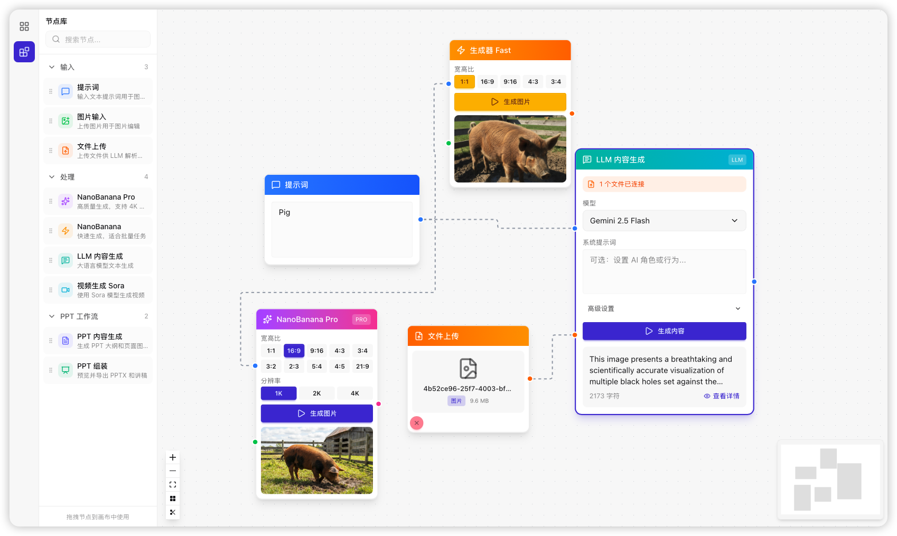
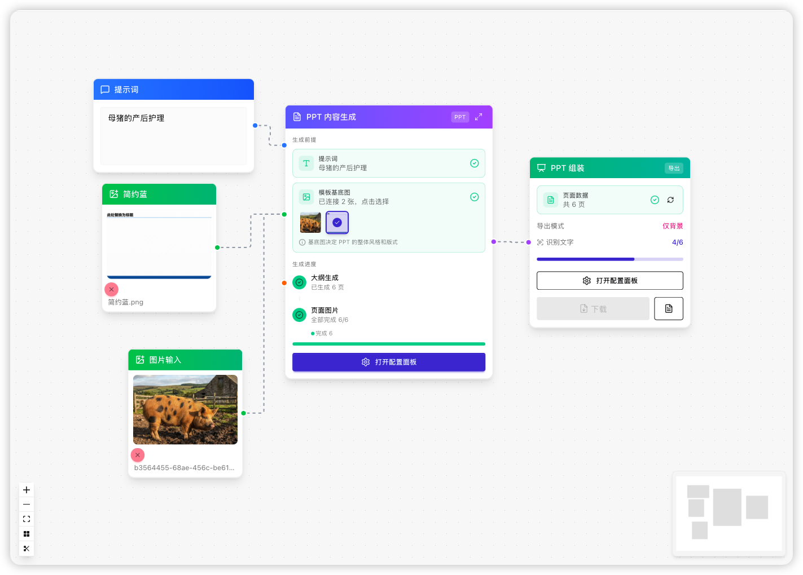
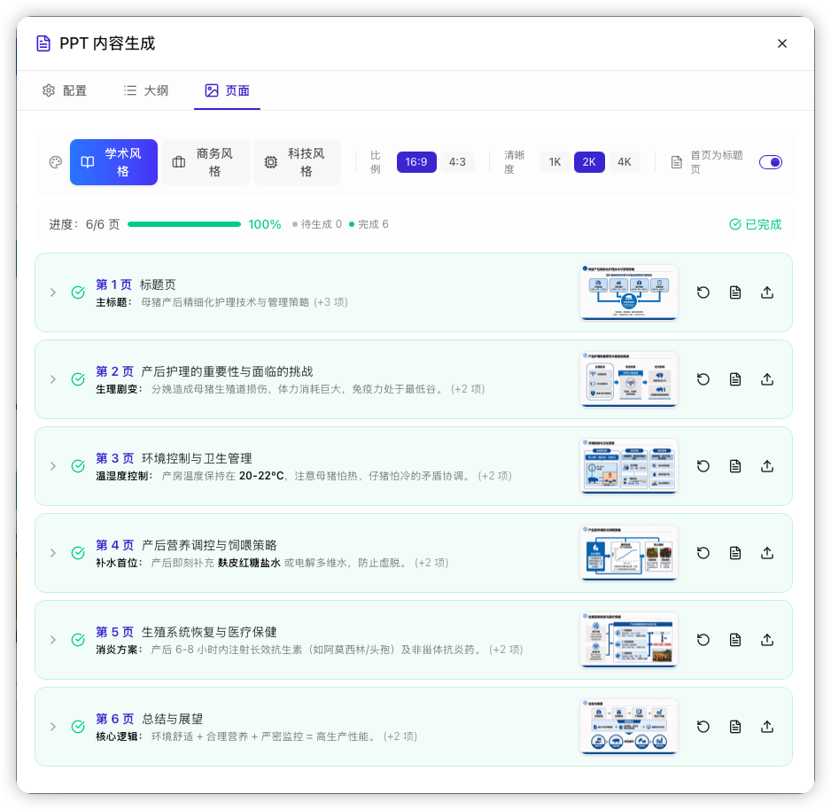
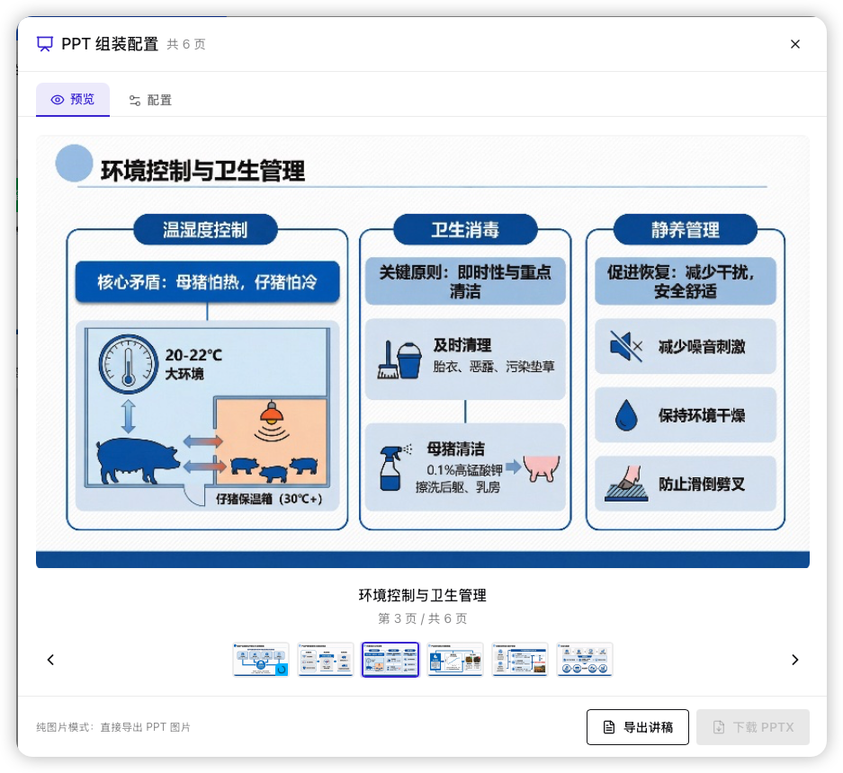
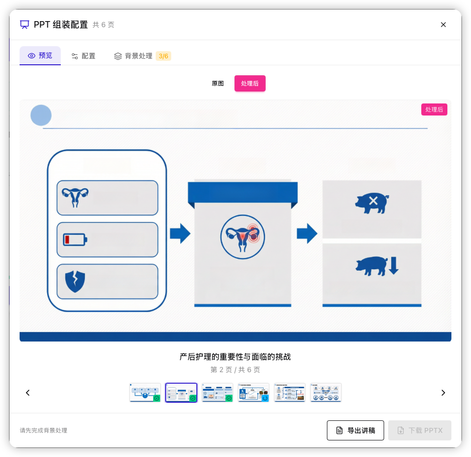
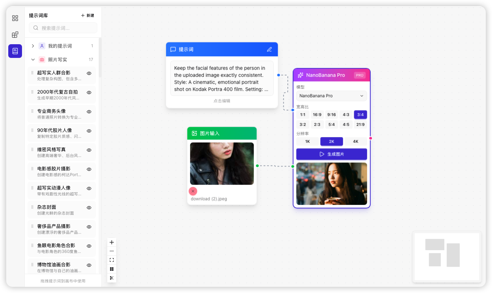

<div align="center">
  
  <h1>NextLemon</h1>
  <p>基于可视化节点的 AI 内容生成工作流工具</p>

  
  
  
  
  
</div>

---

## 功能特性

- **节点编辑器** - 拖拽式工作流设计，支持撤销/重做、复制粘贴、自动布局
- **多画布管理** - 创建多个独立画布，数据自动持久化
- **AI 图片生成** - 支持 NanoBanana 文生图、图生图，可配置分辨率和比例
- **AI 视频生成** - 基于 Sora 模型的视频生成
- **LLM 文本生成** - 支持多模态输入（文本/图片/PDF）
- **PPT 工作流** - 自动生成大纲、PPT页面，导出可编辑文字的 PPTX
- **Prompt 提示词库** - 内置大量绘图提示词，可拖拽至画布，快速使用，可添加自定义提示词。
- **工作流编排** - 支持工作流批量并行启动

## 截图预览

### 主界面


### PPT 工作流


### PPT 页面生成


### PPT 预览导出

**纯图片模式** - 直接导出 PPT 图片


**可编辑模式** - 去除文字仅保留背景，方便后期编辑


### Prompt 库

**Pormpt 提示词库** - 内置几十种提示词，可以拖拽至画布，快速开始使用


## 快速开始

前往 [Releases](https://github.com/MoonWeSif/NextLemon/releases) 下载最新版本：

- **macOS (Apple Silicon)**: `NextLemon_*_aarch64.dmg`
- **macOS (Intel)**: `NextLemon_*_x64.dmg`
- **Windows**: `NextLemon_*_x64-setup.exe`

### macOS 安装提示

由于应用未经 Apple 签名，首次打开可能会提示"无法验证开发者"。请在终端执行以下命令解决：

```bash
xattr -rc "/Applications/NextLemon.app"
```

## 使用流程

1. **配置供应商** - 点击右上角「供应商管理」，添加 API 供应商（如 OpenAI、Google Gemini 等）
2. **分配供应商** - 在供应商管理中为不同节点类型（图片生成、视频生成、LLM 等）指定默认供应商
3. **创建工作流** - 从左侧节点面板拖拽节点到画布，连接节点构建工作流
4. **运行生成** - 填写输入内容，点击节点的生成按钮即可

## 本地开发

```bash
# 安装依赖
bun install

# 开发模式
bun run tauri dev

# 构建应用
bun run tauri build
```

## 可选：OCR + Inpaint 服务

如需使用 **PPT 可编辑导出**功能（去除文字仅保留背景），需要 OCR 和 Inpaint 服务。

### 方式一：使用公益服务

项目提供公益服务，可直接在设置中配置使用：

| 服务 | 地址 | 用途 |
|------|------|------|
| EasyOCR | http://152.67.202.21:8866 | 文字检测识别 |
| IOPaint | http://152.67.202.21:8877 | AI 背景修复 |

> ⚠️ **注意**：公益服务受限于服务器性能，处理速度较慢，且不保障可用性。建议本地部署以获得更好体验。

### 方式二：本地部署（推荐）

```bash
cd docker
docker-compose up -d
```

| 服务 | 地址 | 用途 |
|------|------|------|
| EasyOCR | http://127.0.0.1:8866 | 文字检测识别 |
| IOPaint | http://127.0.0.1:8080 | AI 背景修复 |

> 首次启动需下载模型，约 3-5 分钟

## 技术栈

| 层级 | 技术 |
|------|------|
| 前端 | React 19 + TypeScript + Tailwind CSS + daisyUI |
| 后端 | Tauri 2 (Rust) |
| 状态 | Zustand + IndexedDB |
| 节点 | @xyflow/react |

## 致谢

- [Nanobanana 提示词](https://github.com/ZeroLu/awesome-nanobanana-pro) - 本项目的内置提示词参照该仓库,感谢项目作者的整理与各个提示词的贡献者。

## 许可证

本项目基于 [GNU Affero General Public License v3](https://www.gnu.org/licenses/agpl-3.0.html) 发行，详细条款请参阅仓库根目录的 `LICENSE` 文件。